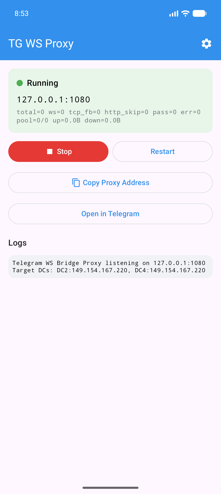
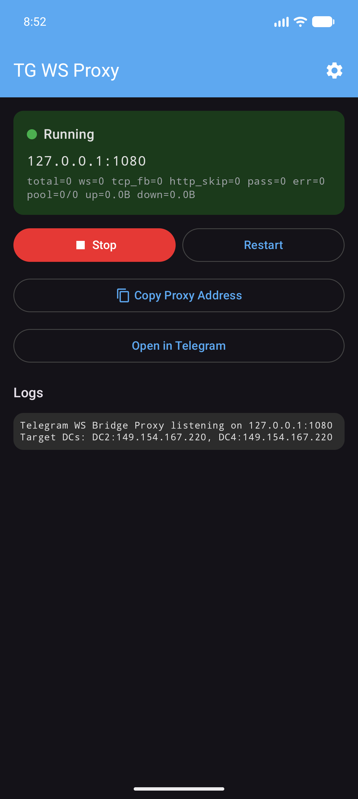

# TG WS Proxy — Android

Native Android port of [tg-ws-proxy](https://github.com/Flowseal/tg-ws-proxy) — a local **SOCKS5 proxy** that speeds up Telegram by routing traffic through WebSocket connections. Data stays end-to-end encrypted (MTProto), no third-party servers involved.

<p align="center">
  
  &nbsp;&nbsp;
  
</p>

## How it works

```
Telegram Android → SOCKS5 (127.0.0.1:1080) → TG WS Proxy → WSS → Telegram DC
```

1. The app runs a local SOCKS5 proxy server on `127.0.0.1:1080`
2. Intercepts connections to Telegram IP addresses
3. Extracts the DC ID from the MTProto obfuscation init packet
4. Establishes a WebSocket (TLS) connection to the corresponding DC via Telegram domains
5. Falls back to direct TCP automatically if WebSocket is unavailable (302 redirect)

Non-Telegram traffic is passed through directly.

## Features

- **Foreground service** — keeps running reliably in the background with a persistent notification
- **WebSocket connection pool** — pre-established connections for faster handshakes
- **MTProto message splitting** — correctly handles coalesced/split TCP packets
- **Auto DC detection** — identifies target datacenter from the init packet, patches DC ID when needed
- **Light & Dark themes** — follows system theme by default, or choose manually
- **Start on boot** — optional autostart via boot receiver
- **Wake lock** — prevents the device from killing the proxy during sleep
- **Copy proxy address / Open in Telegram** — one-tap setup

## Quick start

1. Install the APK from the [Releases](https://github.com/Flowseal/tg-ws-proxy-android/releases) page
2. Open the app and tap **Start**
3. Tap **Open in Telegram** to automatically configure the proxy, or set it up manually:
   - Telegram → **Settings** → **Data and Storage** → **Proxy** → **Add Proxy**
   - **Type:** SOCKS5
   - **Server:** `127.0.0.1`
   - **Port:** `1080`
   - **Username / Password:** leave empty

## Settings

Tap the ⚙️ gear icon in the top bar to access settings:

| Setting | Default | Description |
|---------|---------|-------------|
| Theme | System | Light, Dark, or follow System |
| SOCKS5 Port | `1080` | Local proxy listening port |
| DC IPs | `2:149.154.167.220`, `4:149.154.167.220` | Target IP per datacenter (`DC:IP` format) |
| Pool Size | `4` | Number of pre-established WebSocket connections per DC |
| Buffer KB | `256` | Socket send/receive buffer size in KB |
| Start on boot | Off | Automatically start the proxy service on device boot |

Settings are applied after tapping **Save & Restart**.

## Requirements

- Android 7.0+ (API 24)
- No root required

## Building from source

```bash
git clone https://github.com/Flowseal/tg-ws-proxy-android.git
cd tg-ws-proxy-android
./gradlew assembleDebug
```

The APK will be at `app/build/outputs/apk/debug/app-debug.apk`.

## Credits

This is a native Android (Kotlin + Jetpack Compose) port of the original Python project [tg-ws-proxy](https://github.com/Flowseal/tg-ws-proxy) by [Flowseal](https://github.com/Flowseal).

## License

[MIT License](LICENSE)
